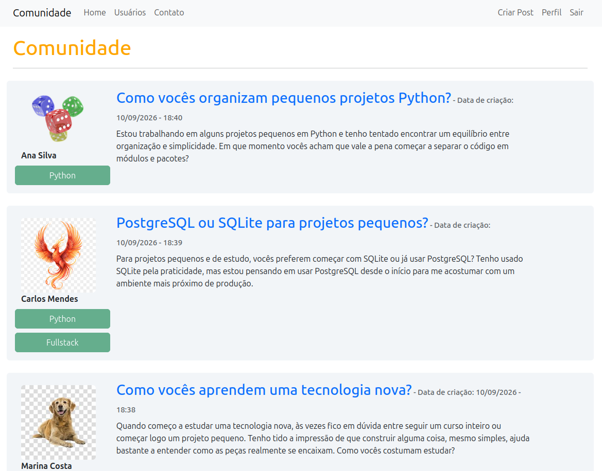
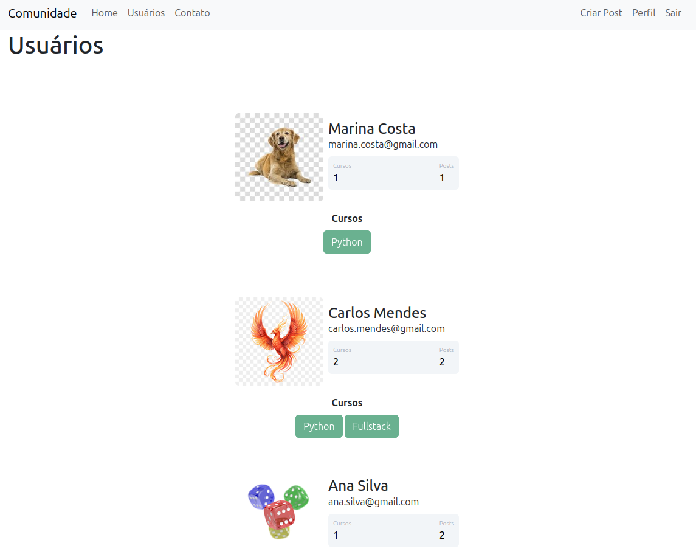
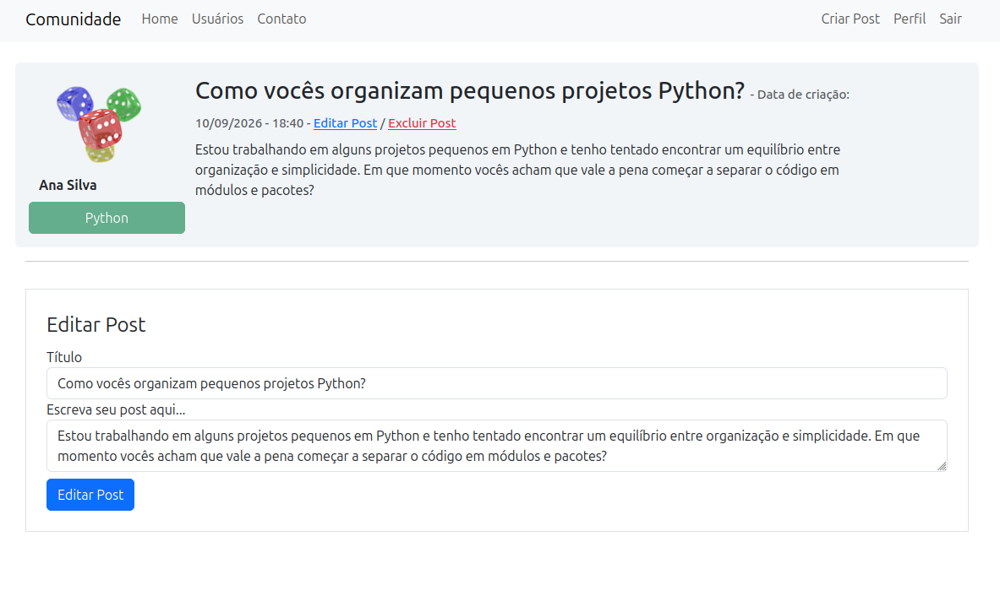
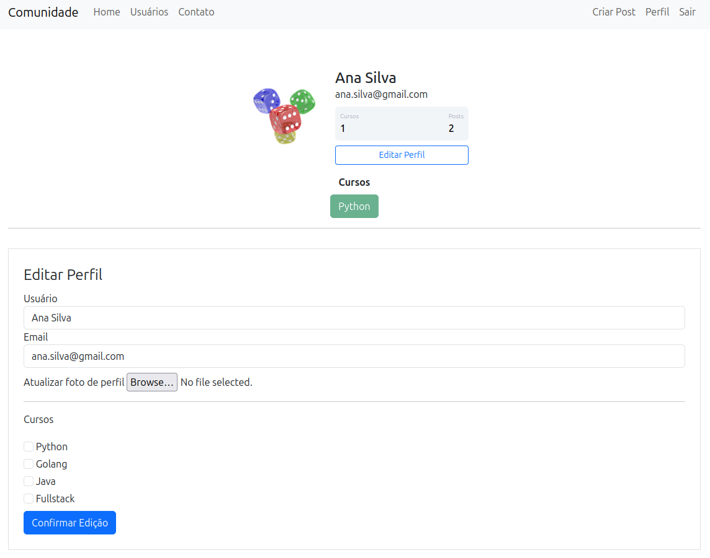

# Community

A web application built with Flask that allows users to create accounts, manage their profiles and publish posts.

The project was developed as a practical exercise in web development, database integration, authentication, file storage and containerization.

## Features

* User registration and authentication
* Login and logout
* User profiles
* Profile editing
* Profile image upload
* Automatic image resizing
* Post creation
* Post editing
* Post deletion
* User listing
* Contact page

## Tech Stack

* **Python**
* **Flask**
* **Flask-SQLAlchemy**
* **Flask-Login**
* **Flask-Bcrypt**
* **Flask-WTF**
* **PostgreSQL**
* **MinIO**
* **boto3**
* **Pillow**
* **Docker**
* **Docker Compose**

## Architecture

The application runs in containers using Docker Compose.

```text
                         ┌───────────────┐
                         │    Browser    │
                         └───────┬───────┘
                                 │
                                 ▼
                         ┌───────────────┐
                         │     Flask     │
                         │      app      │
                         └───────┬───────┘
                                 │
                    ┌────────────┴────────────┐
                    │                         │
                    ▼                         ▼
             ┌───────────────┐        ┌───────────────┐
             │  PostgreSQL   │        │     MinIO     │
             │    database   │        │ object store  │
             └───────────────┘        └───────┬───────┘
                                              │
                                              ▼
                                       ┌───────────────┐
                                       │    Bucket     │
                                       └───────────────┘
```

### Services

The `docker-compose.yaml` defines four containers:

#### `app`

Runs the Flask application.

The application is built from the Dockerfile located at:

```text
app/Dockerfile
```

The application is exposed on port `5000`.

#### `db`

Runs PostgreSQL 18 and stores the application's relational data.

PostgreSQL data is persisted using the `postgres_data` Docker volume.

#### `minio`

Runs MinIO as an S3-compatible object storage service.

It is used to store uploaded files such as profile images.

MinIO data is persisted using the `minio_data` Docker volume.

The MinIO API is exposed on port `9000` and its web console on port `9001`.

#### `minio-init`

Initializes the MinIO environment after the MinIO server becomes healthy.

The initialization script:

```text
minio/init_minio.sh
```

is responsible for configuring the bucket and its initial contents.

This container is an initialization container rather than part of the application's runtime.

## File Storage

Profile images are stored in MinIO instead of being stored directly in the Flask container.

The application communicates with MinIO through the S3 API using `boto3`.

```text
User
  │
  │ uploads image
  ▼
Flask
  │
  │ Pillow
  │ resize/process image
  ▼
boto3
  │
  │ S3 API
  ▼
MinIO
  │
  ▼
Bucket
```

This separates uploaded files from the application container and provides an S3-compatible storage layer.

## Docker Environment

The entire development environment can be started with Docker Compose.

The project uses named Docker volumes to persist data:

```text
postgres_data
minio_data
```

Therefore, stopping the containers does not remove the database or stored objects.

## Requirements

To run the project locally, you need:

* Docker
* Docker Compose
* Git

No local PostgreSQL or MinIO installation is required.

## Running the Project

Clone the repository:

```bash
git clone <repository-url>
cd community
```

## Environment Configuration

Create the environment file with the variables required by the application:

```env
POSTGRES_DB=community
POSTGRES_USER=community
POSTGRES_PASSWORD=change-me

DATABASE_URL=postgresql://community:change-me@db:5432/community

SECRET_KEY=change-me

MINIO_ROOT_USER=minioadmin
MINIO_ROOT_PASSWORD=change-me
MINIO_ENDPOINT=http://minio:9000
MINIO_BUCKET=profile-images
```

Then start the project with:

```bash
make
```

This runs:

```bash
docker compose up -d --build
```

The application will be available at:

```text
http://localhost:5000
```

### Useful commands

Start the application:

```bash
make up
```

Stop the containers:

```bash
make down
```

Remove containers and locally built images:

```bash
make clean
```

Remove containers, images, volumes and orphan containers:

```bash
make fclean
```

> `make fclean` removes the Docker volumes containing PostgreSQL and MinIO data.

## Project Structure

```text
community/
├── app/
│   ├── Dockerfile
│   ├── forms.py
│   ├── __init__.py
│   ├── models.py
│   ├── routes.py
│   ├── static/
│   │   ├── main.css
│   │   └── profile_imgs/
│   │       └── default.jpg
│   └── templates/
│       ├── base.html
│       ├── contact.html
│       ├── create_post.html
│       ├── edit_profile.html
│       ├── home.html
│       ├── login.html
│       ├── navbar.html
│       ├── post.html
│       ├── profile.html
│       └── users.html
│
├── images/
│   ├── 01.png
│   ├── 02.png
│   ├── 03.png
│   └── 04.png
│
├── minio/
│   └── init_minio.sh
│
├── docker-compose.yaml
├── .env.example
├── LICENSE
├── main.py
├── Makefile
├── README.md
└── requirements.txt
```

## Environment Configuration

The application uses environment variables for configuration and credentials.

The following services require environment configuration:

* Flask
* PostgreSQL
* MinIO

Sensitive values such as passwords and secret keys should not be committed to the repository.

## Development Goals

This project was built to practice the development of a complete web application, including:

* Flask application development
* User authentication
* Database modeling with SQLAlchemy
* Form handling
* File uploads
* Image processing
* S3-compatible object storage
* Docker containerization
* Service orchestration with Docker Compose
* Persistent storage using Docker volumes

## Roadmap

Future improvements may include:

* Production deployment
* Automated tests
* CI/CD
* Improved error handling
* Additional user interactions
* Production-ready configuration
* HTTPS

## License

This project is licensed under the terms of the license included in this repository.

## Live Demo

The application is deployed on Railway and available online:

**https://community-production-932f.up.railway.app/**

## Screenshots

### Home



### Usuários



### Editar publicação



### Editar perfil

